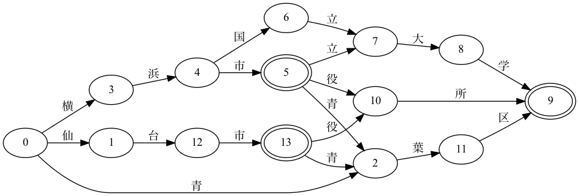

# dawg-go

文字列の辞書を空間効率的に格納する DAWG (DAFSA) というデータ構造のナイーブな Go 実装です。

(実行速度や省メモリ性などは考慮していません)

DAWG の説明 (Wikipedia): https://en.wikipedia.org/wiki/Deterministic_acyclic_finite_state_automaton



例えば次のような用途に使えます:

- 辞書に含まれる語を文章から抽出する。
- あいまい検索（スペルチェック）

## Usage

#### 基本的な使い方

```go
// DAWG を構築
builder := dawg.NewBuilder()
builder.AddWord("仙台市")
builder.AddWord("仙台市青葉区")
builder.AddWord("仙台市役所")
builder.AddWord("青葉区")
builder.AddWord("横浜市")
builder.AddWord("横浜市役所")
builder.AddWord("横浜市立大学")
builder.AddWord("横浜国立大学")
builder.AddWord("横浜市青葉区")
wg := builder.Build()

// DAWGが指定の語を含むかどうか
if wg.Contains("横浜市") {
  fmt.Println("横浜市")
}

// DAWGを辞書として、文字列から語を抽出する
for _, r := range dawg.ExtractKeywords(wg, "青葉区といえば仙台市青葉区と横浜市青葉区があります") {
  fmt.Println(r)
  // -> {true 青葉区}
  // -> {false といえば}
  // -> {true 仙台市青葉区}
  // -> {false と}
  // -> {true 横浜市青葉区}
  // -> {false があります}
}

// DAWGに含まれる語をあいまい検索する
for _, hit := range dawg.FuzzySearch(wg, "横浜私立大学") {
  fmt.Println(hit)
  // -> {横浜市立大学 2}
  // -> {横浜国立大学 2}
}
```

#### シリアライズ・デシリアライズ

DAWG をファイルに書き出したり、ファイルから読み込んだりできます。

```go
if f, err := os.OpenFile("dictionary.dawg", os.O_RDWR|os.O_CREATE, 0666); err != nil {
  panic(err)
} else {
  defer f.Close()
  w := bufio.NewWriter(file)
  d.Serialize(w)
  w.Flush()
  file.Close()
}

if f, err := os.Open("dictionary.dawg"); err != nil {
  panic(err)
} else {
  defer f.Close()
  since := time.Now()
  r := bufio.NewReader(file)
  if d, err = dawg.Deserialize(r); err != nil {
    t.Fatal(err)
  }
  fmt.Printf("%v", time.Since(since))
}
```


#### 可視化 (Graphviz, Mermaid)

デバッグ等のために、DAWGを Graphviz の dot ファイルや、Mermaid の flowchart として出力できます。

```go
// DAWG を Graphviz の dot 形式で出力
f, err := os.OpenFile("docs/example.dot", os.O_RDWR|os.O_CREATE, 0644)
if err != nil {
  panic(err)
}
defer f.Close()
w := bufio.NewWriter(f)
wg.DumpAsDot(w)
w.Flush()

// DAWG を Mermaid の flowchart として出力
f, err = os.OpenFile("docs/example.txt", os.O_RDWR|os.O_CREATE, 0644)
if err != nil {
  panic(err)
}
defer f.Close()
w = bufio.NewWriter(f)
wg.DumpAsMermaid(w)
w.Flush()
```
